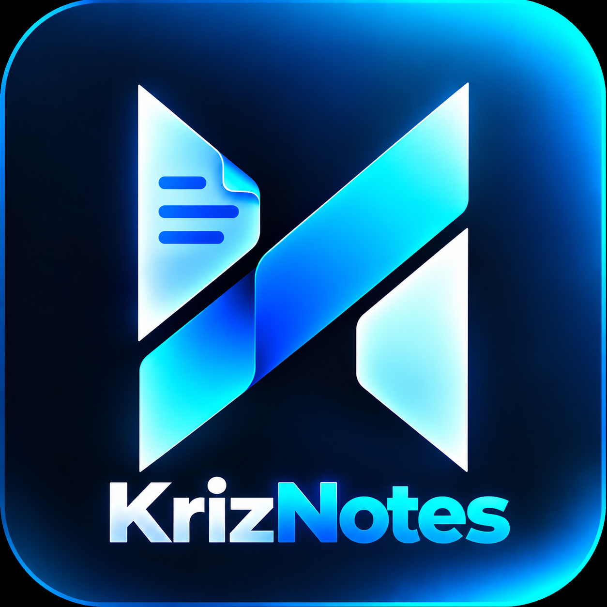
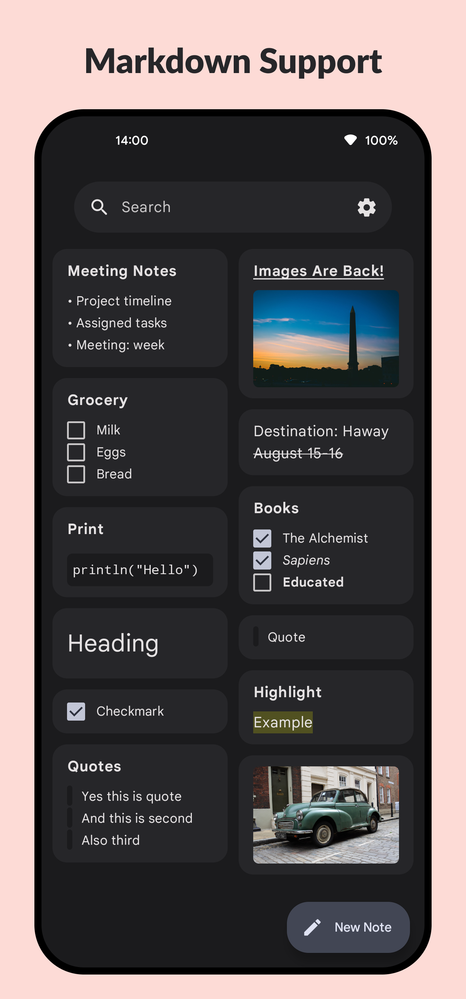
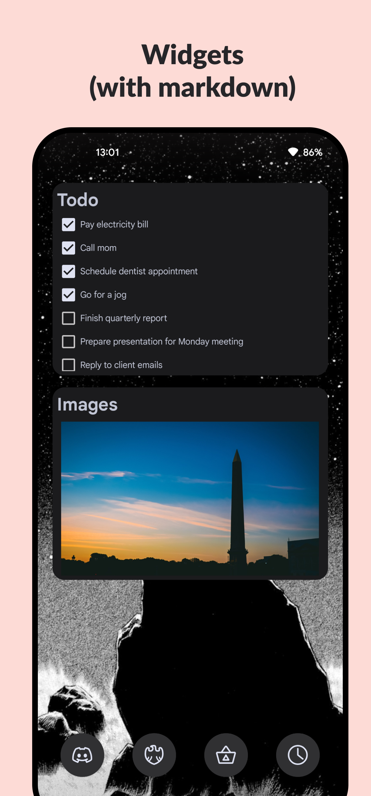
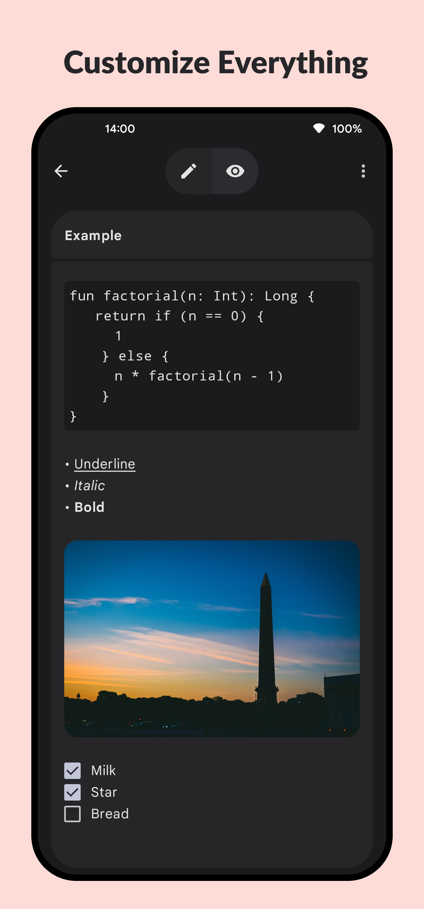

<div align="center">

  <!-- Logo -->
  <a href="https://altkriz.github.io" target="_blank">
    
  </a>

  # KrizNotes

  **Simple, Private & Open Source Note-Taking for Android**

  [](https://www.gnu.org/licenses/gpl-3.0)
  [](https://android.com)
  [](https://kotlinlang.org)
  [](#privacy)

  <br>

  <!-- Download & Action Buttons -->
  <div>
    <a href="https://github.com/altkriz/KrizNotes/releases" target="_blank">
      
    </a>
    &nbsp;
    <a href="https://altkriz.github.io" target="_blank">
      
    </a>
    &nbsp;
    <a href="https://www.instagram.com/altkriz/" target="_blank">
      
    </a>
  </div>

  <br>

  ---

  ### 📱 Screenshots

  <div>
    
    
    
  </div>

  ---

</div>

## 💡 Our Motto

> **"We don't need money from our users — we believe in giving you free, private, and open-source software. We just want your love and support!"** ❤️

KrizNotes has **no ads, no paywalls, no tracking, and no donation gates**. Everything is completely free, transparent, and open source under the GNU GPL-3.0 license.

---

## ✨ Features

- 🔒 **100% Offline & Private:** Zero cloud sync, zero telemetry, and zero accounts required. All notes are saved strictly on your local device in an encrypted Room SQLite database.
- 🛡️ **Encrypted Note Vault:** Secure sensitive notes with custom passcode protection. Hidden and encrypted until unlocked.
- ✍️ **Rich Markdown Editing:** Full markdown support with headers, bold, italics, checklists, lists, blockquotes, and code syntax highlighting with live preview.
- 📂 **Text File Import & Backups:** Import `.txt` and `.md` files directly into your notes. Create password-protected encrypted `.zip` backup archives anytime.
- 🎨 **Material You & AMOLED Dark Mode:** Adaptive system dynamic theming, custom accent colors, adjustable card corner radius, and a true-black Extreme AMOLED mode.
- 👁️ **Privacy Screen Protection:** Optional `FLAG_SECURE` mode blocks screenshots and obscures app contents from the recent apps switcher.
- ⚡ **Lightweight & Fast:** Built natively with Kotlin and Jetpack Compose for buttery-smooth performance.

---

## 🔒 Privacy & Permissions

KrizNotes is designed with absolute privacy in mind:
- **No Personal Data Collected:** We do not collect, transmit, store, or sell your personal details or note contents.
- **Minimal Permissions:** Only uses Android's native Storage Access Framework (SAF) when you manually choose to import/export notes, and biometric hardware for unlocking your vault.
- Read our full [Privacy Policy](privacy.html) and [Terms of Service](terms.html).

---

## 🔑 Release Certificate Fingerprints

Official release builds are signed with our dedicated release certificate:

- **Algorithm:** RSA 2048-bit (APK Signature Scheme v2)
- **SHA-256:** `1a:58:2a:6f:e5:ea:e2:d4:4a:2b:1b:60:3b:00:b7:9b:61:cd:28:3a:33:4d:e5:9c:72:cd:c5:fc:0c:30:34:67`
- **SHA-1:** `67:a0:c2:6d:9c:77:b2:03:2c:70:6d:31:6d:29:ee:83:0c:75:fe:bc`
- **MD5:** `1d:7f:be:3b:4a:f3:01:f0:b9:36:75:6f:5e:9a:df:3b`

---

## 💬 Community & Contact

- **Developer:** altkriz
- **Email:** [altkriz@proton.me](mailto:altkriz@proton.me)
- **Website:** [altkriz.github.io](https://altkriz.github.io)
- **Instagram:** [@altkriz](https://www.instagram.com/altkriz/)
- **Feature Requests / Issues:** [GitHub Issues](https://github.com/altkriz/KrizNotes/issues)

---

## 📜 License

KrizNotes is distributed under the **GNU General Public License v3.0 (GPL-3.0)**.

```text
KrizNotes
Copyright (C) 2026 altkriz

This program is free software: you can redistribute it and/or modify
it under the terms of the GNU General Public License as published by
the Free Software Foundation, either version 3 of the License, or
(at your option) any later version.

This program is distributed in the hope that it will be useful,
but WITHOUT ANY WARRANTY; without even the implied warranty of
MERCHANTABILITY or FITNESS FOR A PARTICULAR PURPOSE. See the
GNU General Public License for more details.
```

See the full [LICENSE](LICENSE) file for more information.
